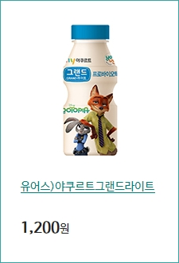
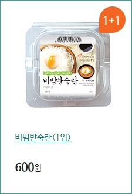
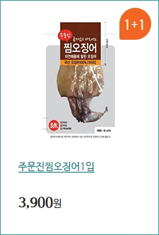
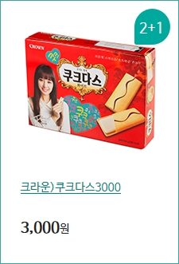
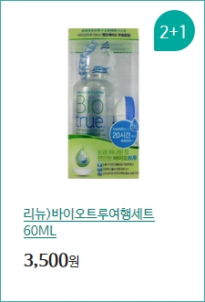
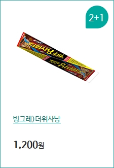

<!DOCTYPE html>
<html>
<head>
  <title>MENU</title>
  <meta charset="utf-8">
  <meta name="viewport" content="width=device-width, initial-scale=1">
  <link rel="stylesheet" href="http://maxcdn.bootstrapcdn.com/bootstrap/3.3.6/css/bootstrap.min.css">
  <link href="http://fonts.googleapis.com/css?family=Lato" rel="stylesheet" type="text/css">
  <link href="http://fonts.googleapis.com/css?family=Montserrat" rel="stylesheet" type="text/css">
  
  
  
</head>
<body id="myPage" data-spy="scroll" data-target=".navbar" data-offset="50">
<nav class="navbar navbar-default navbar-fixed-top">
  

    

      <button type="button" class="navbar-toggle" data-toggle="collapse" data-target="#myNavbar">
        
        
                                
      </button>
      <a class="navbar-brand" href="#">MENU</a>
    

    

      <ul class="nav navbar-nav navbar-right">
        <li><a href="#NEW">NEW</a></li>
        <li><a href="#1+1">1+1</a></li>
        <li><a href="#product">product</a></li>
      </ul>
    

  

</nav>

  <h3>NEW</h3>
  <!DOCTYPE html>
<html>
   <head>
      <link type="text/css" rel="stylesheet" href="stylesheet.css" />
      <title>My Photo Page</title>
   </head>
   <body>
   <table>
   <tr>
    <td>
      
    </td>
    <td>
      
    </td>
    <td>
      
      </td>
    </tr>
   <tr>
    <td>
      
    </td>
    <td>
      
    </td>
    <td>
      
    </td>
  </tr>
   <tr>
    <td>
      
    </td>
    <td>
      
    </td>
    <td>
      
    </td>
  </tr>
   </table>
   </body>
</html>
</body>
</html>

  <h3>1+1</h3>
  
    <!DOCTYPE html>
<html>
   <head>
      <link type="text/css" rel="stylesheet" href="stylesheet.css" />
      </head>
   <body>
   <table>
   <tr>
    <td>
      
    </td>
    <td>
      
    </td>
    <td>
      
      </td>
    </tr>
    <tr>
    <td>
      
    </td>
    <td>
      
    </td>
    <td>
      
      </td>
    </tr>
    <tr>
    <td>
      
    </td>
    <td>
      
    </td>
    <td>
      
      </td>
    </tr>
</table>
   </body>
</html>

  <h3>product</h3>
  <tr>
    <td>
      
    </td>
    <td>
      
    </td>
    <td>
      
      </td>
    </tr>
<tr>
    <td>
      
    </td>
    <td>
      
    </td>
    <td>
      
      </td>
    </tr>
    <tr>
    <td>
      
    </td>
    <td>
      
    </td>
    <td>
      
      </td>
    </tr>
    <tr>
    <td>
      
    </td>
    <td>
      
    </td>
    <td>
      
      </td>
    </tr>
    <tr>
    <td>
      
    </td>
    <td>
      
    </td>
    <td>
      
      </td>
    </tr>
    <tr>
    <td>
      
    </td>
    <td>
      
    </td>
    <td>
      
      </td>
    </tr>
    <tr>
    <td>
      
    </td>
    <td>
      
    </td>
    <td>
      
      </td>
    </tr>
    <tr>
    <td>
      
    </td>
    <td>
      
    </td>
    <td>
      
      </td>
    </tr>
    <tr>
    <td>
      
    </td>
    <td>
      
    </td>
    <td>
      
      </td>
    </tr>
    <tr>
    <td>
      
    </td>
    <td>
      
    </td>
    <td>
      
      </td>
    </tr>
    <tr>
    <td>
      
    </td>
    <td>
      
    </td>
    <td>
      
      </td>
    </tr>
    <tr>
    <td>
      
    </td>
    <td>
      
    </td>
    <td>
      
      </td>
    </tr>
    <tr>
    <td>
      
    </td>
    <td>
      
    </td>
    <td>
      
      </td>
    </tr>
    <tr>
    <td>
      
    </td>
    <td>
      
    </td>
    <td>
      
      </td>
    </tr>
    <tr>
    <td>
      
    </td>
    <td>
      
    </td>
    <td>
      
      </td>
    </tr>
    <tr>
    <td>
      
    </td>
    <td>
      
    </td>
    <td>
      
      </td>
    </tr>
    <tr>
    <td>
      
    </td>
    <td>
      
    </td>
    <td>
      
      </td>
    </tr>
    <tr>
    <td>
      
    </td>
    <td>
      
    </td>
    <td>
      
      </td>
    </tr>
    <tr>
    <td>
      
    </td>
    <td>
      
    </td>
    <td>
      
      </td>
    </tr>
    <tr>
    <td>
      
    </td>
    <td>
      
    </td>
    <td>
      
      </td>
    </tr>
    <tr>
    <td>
      
    </td>
    <td>
      
    </td>
    <td>
      
      </td>
    </tr>
    <tr>
    <td>
      
    </td>
    <td>
      
    </td>
    <td>
      
      </td>
    </tr>
  

</body>
</html>
